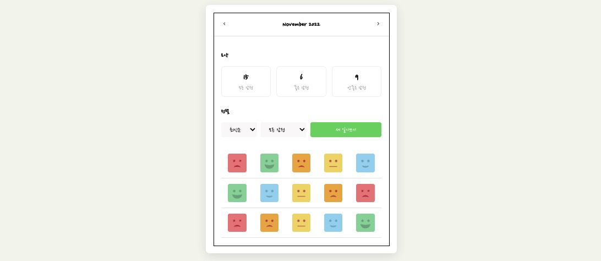

# React Emotion Diary App

간단한 CRUD 기능을 갖춘 감성 일기장 애플리케이션.

**웹 배포 : [https://prototypediary.netlify.app/](https://prototypediary.netlify.app/)**

#### Made with 🐥 by [Pazival8971](https://github.com/Parzival8971)

---

## 프로젝트 설명

이 프로젝트는 Todo 애플리케이션을 활용하여, `감정 일기 다이어리`를 만듭니다.
간단한 CURD 기능을 갖추고 작업을 수행하였습니다. `React.js`를 사용하고, 상태를 관리하기 위해 `Redux`를 사용하였습니다. UI 부분은 `CSS`을 사용하였습니다. 이 앱을 만들면서 소규모이지만, `React`의 컴포넌트 단위 재사용의 중요성과 성능개선을 위한 메모이제이션 처리에 대해 학습을 중점으로 만들었습니다.

---

## 사용한 라이브러리

- [React](https://reactjs.org/)
- [react-router-dom](https://reactrouter.com/)
- [React Redux](https://redux.js.org/)
- [React icons](https://react-icons.netlify.com/)
- [shortid](https://github.com/dylang/shortid)

---

## 구조도

```
📦
├─ src
│  ├─ App.css
│  ├─ App.tsx
│  ├─ index.css
│  ├─ index.tsx
│  ├─ components
│  │  ├─ DiaryEditor.tsx
│  │  ├─ DiaryItem.tsx
│  │  ├─ DiaryList.tsx
│  │  ├─ EmotionItem.tsx
│  │  ├─ MyButton.tsx
│  │  ├─ MyCountScore.tsx
│  │  ├─ MyHeader.tsx
│  ├─ pages
│  │  ├─ Diary.tsx
│  │  ├─ Edit.tsx
│  │  ├─ Home.tsx
│  │  └─ New.tsx
│  ├─ redux
│  │  ├─ modules
│  │  │  ├─ items.ts
│  │  │  └─ reudcer.ts
│  │  └─ store.ts
│  └─ util
│     ├─ date.ts
│     └─ emotion.ts
└─ tsconfig.json
```

---

## 상단 Header의 MyButton 컴포넌트의 재사용성

- Mybutton은 props로 받는 타입에 따라 className 스타일이 동적 추가됩니다.
- 이제 어디서든 꺼내어서 타입에 따라 재사용 할 수 있습니다.
  

```jsx
😀 Home.tsx
  <div className='HomePage'>
    <MyHeader
      // 컴포넌트에서 자식으로 또 컴포넌트를 내려서 재사용 한 것
      headText={headText}
      leftChild={<MyButton text={<BiChevronLeft/>} onClick={decreaseMonth} />}
      rightChild={<MyButton text={<BiChevronRight/>} onClick={increaseMonth} />}
    />
  </div>

😃 Myheader.tsx
  const MyHeader = ({ headText, leftChild, rightChild }: PropsType) => {
    return (
      // left,right Child로서 부품화한 MyButton 컴포넌트를 내려받아 재사용
      <header>
        <div className='head_btn_left'>{leftChild}</div>
        <div className='head_text'>{headText}</div>
        <div className='head_btn_right'>{rightChild}</div>
    </header>
  )};

😄 MyButton.tsx
  // text와 type을 받아서 그에 따라 타입의 버튼의 색 구분을 위한 재사용 컴포넌트로 활용
  const MyButton = ({ text, type, onClick }: PropsType) => {
  const btnType = ['positive', 'negative', 'cancel'].includes(type) ? type : 'default';
  return (
    <button
      className={['MyButton', `MyButton_${btnType}`].join(' ')}
      onClick={onClick}>
      {text}
    </button>
  );
};
```

## 최신순 Sort 기능과 감정점수에 따른 filter 기능을 만들었습니다.

- 정렬기능을 담을 state와 필터기능을 담을 state로 만들어서 데이터를 반환합니다.
- 이 부분은 만들면서 이해하기가 어려웠습니다. ⭐️ 자세히 설명을 기록해둡니다.
  

```jsx
😀 DiaryList.tsx
// 두 개의 select 버튼에에 사용할 상숫값을 지정합니다.
 const sortOptionList = [
  { value: 'latest', name: '최신순' },
  { value: 'oldest', name: '오래된 순' },
];

const filterOptionList = [
  { value: 'all', name: '모든 감정' },
  { value: 'good', name: '좋은 감정만' },
  { value: 'bad', name: '안좋은 감정만' },
];

const DiaryList = ({ diaryList }: PropsType) => {
  // select 버튼 상태관리를 위한 state입니다.
  const [sortType, setSortType] = useState<string>('latest');
  const [filter, setFilter] = useState<string>('all');
  // 원본 diaryList를 깊은복사로 filter 기능을 가공합니다.
  const getProcessedDiaryList = () => {
    // state의 값 good에 따라 filter 함수 구현를 합니다.
    const filterCallBack = (item: { emotion: string }): boolean => {
      if (filter === 'good') {
        return parseInt(item.emotion) < 3;
      } else {
        return parseInt(item.emotion) >= 3;
      }
    };
// sortType state의 값 latest에 따라 sort 함수 구현를 합니다.
    const compare = (a: { date: string }, b: { date: string }) => {
      if (sortType === 'latest') {
        return parseInt(b.date) - parseInt(a.date);
      } else {
        return parseInt(a.date) - parseInt(b.date);
      }
    };
// diarList 원본 값을 sort경우 원본이 바뀌게 됨, 깊은복사로 원본과 다른 값 복사합니다.
    const copyList = JSON.parse(JSON.stringify(diaryList));
    // state의 값이 all일 경우는 전부다, 아닐 경우는 필터 적용합니다.
    const filteredList =
      filter === 'all'
        ? copyList
        : copyList.filter((it: { emotion: string }) => filterCallBack(it));
    // 필터가 적용된 diaryList에 sort 함수를 적용합니다.
    const sortedList = filteredList.sort(compare);
    return sortedList;
  };

```

## Header 상단의 년도, 날짜, 시간 필터링 기능을 만들었습니다.

- 해당연도의 달의 첫 번째 날짜와 마지막 날짜의 끝 시간까지 구해서 필터링하기
- new Date 메서드를 커스텀 하여서, 필터링합니다. ⭐️ 처음이라 어려웠습니다.
  

```jsx
😀 Home.tsx
//
 useEffect(() => {
  // data가 하나라도 있다면,
    if (diaryList.length >= 1) {
      // 이번 연도 해당 달의 첫 날짜를 구합니다.
      const firstDay = new Date(
        curDate.getFullYear(),
        curDate.getMonth(),
        1
      ).getTime();
      // 이번 연도 해당 달의 마지막 날짜 마지막 시간,분,초 까지 구합니다.
      const lastDay = new Date(
        curDate.getFullYear(),
        curDate.getMonth() + 1,
        0,
        23,
        59,
        59
      ).getTime();
      // 첫 날짜와 ~ 마지막 날짜의 끝까지 필터해서 첫 화면에 렌더링.
      setData(
        diaryList.filter((it) => firstDay <= it.date && it.date <= lastDay)
      );
    }
  }, [diaryList, curDate]);

```

## 새로고침에도 data를 유지하기 위해 localStorage로 데이터 관리하였습니다.

- reducer에서 localStorage.set 값을 저장 후, useEffect로 get 후 데이터 화면보여주기
  

```jsx
😀 redux.items.ts
 export default function reducer(
  previousState: DiaryItemStateType = InitialState,
  action: DiaryItemActionType
) {
  // localStorage에 담기 위해 새로 값을 담을 newState를 만들어주었습니다.
  let newState: DiaryItemStateType = [];
  switch (action.type) {
    case INIT_ITEM: {
      return action.data;
    }
    case CREATE_ITEM: {
      newState = [action.data, ...previousState];
      break;
    }
    case REMOVE_ITEM: {
      newState = previousState.filter((it) => it.id !== action.targetId);
      break;
    }
    case EDIT_ITEM: {
      newState = previousState.map((it) =>
        it.id === action.data.id ? { ...action.data } : it
      );
      break;
    }
    default:
      return previousState;
  }
  // switch문의 break를 거쳐 상태변화 값이 localStorage에 담기게 됩니다.
  localStorage.setItem('diary', JSON.stringify(newState));
  return newState;
}

😎 App.tsx
// App 상위에서 localStorage에 값이 있으면 꺼내서 dispatch로 실행하게 됩니다.
function App() {
  const dispatch = useDispatch();
  useEffect(() => {
    const localData = localStorage.getItem('diary');
    if (localData) {
      const diaryList = JSON.parse(localData).sort(
        (a: { id: string }, b: { id: string }) =>
          parseInt(b.id) - parseInt(a.id)
      );
      if (diaryList.length >= 1) {
        dispatch(initItem(diaryList));
      }
    }
  }, [dispatch]);

```

## useCallback, useMemo, React.Memo를 사용하여 불필요한 리렌더링을 막아주었습니다.

- 코드를 보면서 판단하는 정적분석과 도구를 사용해서 확인하는 동적 분석 두 가지의 경우로 도구를 활용하여 눈으로 체크하였습니다.
- ReactDevTool로 직접 렌더링되는 부분을 보아가면서 useCallback, useMemo, React.Memo로 적용하였습니다.
- 최신버튼과 모든감정의 리렌더링이 일어나는 부분이 없어짐을 확인하였습니다.
  
  

```jsx
😀 DiaryList > ControlMenu.tsx
// React.memo를 통해서 Props로 전달되는 값이 변경되지 않는다면,
// 리렌더링이 일어나지 않도록 최적화, useEffect로도 재확인
// 최신순의 버튼과 모든감정의 버튼의 깜빡임이 사라졌음을 확인
 const ControlMenu = React.memo(
  ({ value, onChange, optionList }: PropsTypeControlMenu) => {
     useEffect(() => {
      console.log('리렌더링진행중....');
    });
    return (
      <select
        className='ControlMenu'
        value={value}
        onChange={(e) => onChange(e.target.value)}
      >
        {optionList.map((it, idx) => (
          <option key={idx} value={it.value}>
            {it.name}
          </option>
        ))}
      </select>
    );
  }
);
```

- EmotionItem에도 React.Memo를 적용용 해주었으나, 리렌더링이 발생하였습니다.
- 이유는 onClick함수를 받았기 때문이였고, 매번 새로운 함수를 렌더링해서 받았기 때문이였습니다.
- 문제의 함수를 찾아서 값변경이 없다면 이전 함수를 처리하도록 useCallback 처리를 하였습니다.
- 이모티콘의 아이콘들의 리렌더링이 일어나는 부분이 없어짐을 확인하였습니다.
  
  

```jsx
😎 EmotionItem.tsx
const EmotionItem = ({emotion_id, emotion_img, emotion_descript, onClick, isSelected,}: PropsType) => {
  return (
    <div
      onClick={() => onClick(emotion_id)}
      className={[
        'EmotionItem',
        isSelected ? `EmotionItem_on_${emotion_id}` : `EmotionItem_off`,
      ].join(' ')}
    >
      
      <span>{emotion_descript}</span>
    </div>
  );
};
export default React.memo(EmotionItem);

// 문제가 되는 함수를 useCallback처리 하여 리렌더링을 방지하였습니다.
const handleClickEmote = useCallback((emotion: number) => {
    setEmotion(emotion);
  }, []);

// 하위 컴포넌트로 함수를 전달
<EmotionItem
  key={it.emotion_id}
  {...it}
  onClick={handleClickEmote}
  isSelected={it.emotion_id === emotion}
 />
```

## 🐥 개인 회고

<br/>

> 🧐 : 상태관리 ? ContextAPI vs Redux

- ContextAPI도 상태관리가 가능은 합니다, 하지만 목적은 props drilling을 피하고자 사용함을 React 공식문서에도 설명이 되어 있습니다. Provider로 상위 컴포넌트로 설정하게 되면, value로 주는 값이 변할 때마다 하위 컴포넌트 또한 전체가 리렌더링 해버린다는 것입니다. 이에 따라 Provider Hell을 유발하고 최적화를 위해 시간을 들여야 한다는 단점이 존재합니다. Redux는 방대한 코드양 증가와 초기설정이 어렵다는 것에 초보자에게 접근이 어렵고 단점이 아닌가 생각합니다. 하지만 자체 메모리 최적화 기능과 파일을 별도로 분리해서 관리하는 덕분에 어느 곳이든 사용할 수 있었습니다. Devtool로 시간을 추적할 수 있어서 왜 ContextAPI를 두고도 Redux의 사용이유와 대규모 프로젝트에는 이러한 점이 당연히 이점이 된다고 생각이 들었습니다.

<br/>

> 🧐 : 동적 타입 언어 ? JavaScript vs TypeScript

- JavaScript는 자유롭게 사용해도 제한이 없었고, TypeScript 엄격모드를 사용한 것 같았습니다. 기존 JS의 경우는 매개변수와 인자 등을 찾기 위해 다시 컴포넌트로 돌아가서 확인하거나, 또는 반환되는 값이 string 인데도 number로 인식이 되어도 형 변환으로 인식에 문제가 없었습니다. 이러한 문제점을 바로 잡아주는 것이 TypeScript가 아닌가 싶습니다. 전부 오류를 잡아주었고, 타입가드로 예방과 초기 흐름을 더 어떻게 잡으면 좋을지 다시 생각해주게 하는 좋은 정적 타입 언어였습니다.

<br/><br/>

## 😂 Self Feedback

<br/>

> 🧑🏻‍💻 : 학습하며 개발과정 중 어려웠던 부분

- MyButton 컴포넌트와 같이 부품화 가능한 부분은 이렇게 사용하는 게 효율적이락 생각이 들었습니다. 기존에는 map으로만 활용 하였지만, 컴포넌트에서 Props 컴포넌트를 내려주는 부분은 알지 못하였고, 이번 기회에 사용법을 알게 되었습니다.
- Redux를 변환하는 과정이 처음 학습자에게는 조금 어려운 부분이었습니다. reducer와 action, store로 파일을 구분했는데, 파일 구조가 나눠지다 보니 여기저기 들어가서 확인해 보는 부분이 어려웠습니다. 학습 중에 Ducks패턴 구조를 알게 되었고 적용해 보았습니다. 확실히 modules 폴더로 관리하니 편했습니다만, 코드가 엄청 길어져 버리는 단점이 생겼습니다.
- 성능 최적화에 대해서 적용하는데 어려웠습니다. 아직 학습한 부분은 useCallback, useMemo, Memo 정도 부분인데, 콜백과 메모에 대해서는 적용을 할 수는 있지만 Memo HOC로 적용하는 부분은 또 equl로 적용을 해주어야하는데 적용을 하면 또 다른곳에서 리렌더링이 일어났습니다. 최소한의 리렌더링 최적화 적용을 알게되었고, 더 깊게 공부해보고 싶습니다.
- 정렬과 필터, 날짜 커스텀 등 바로바로 적용할 수 있는 생각이 나지 않아 구글링을 해가면서 공부하였습니다. 스스로 생각하며 알고리즘과 코딩테스트의 중요성을 느끼고 있습니다. 수학적 사고력도 중요하다고 생각합니다.
